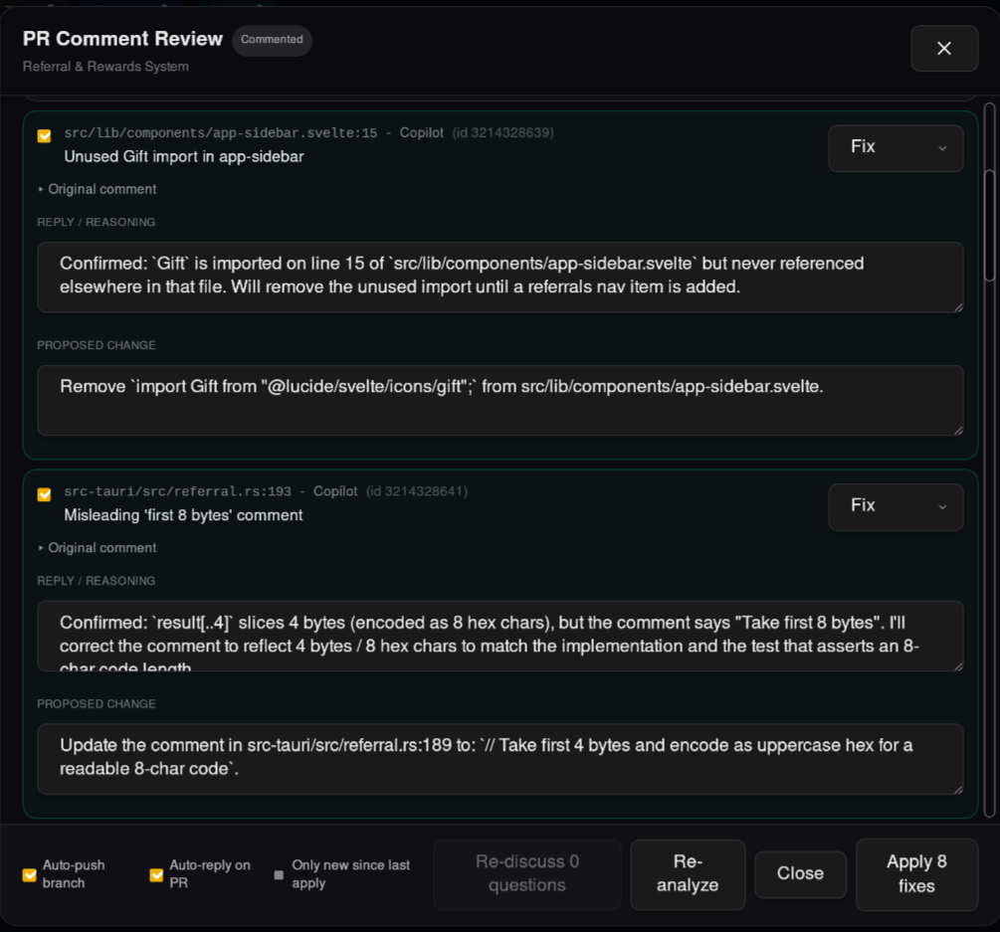
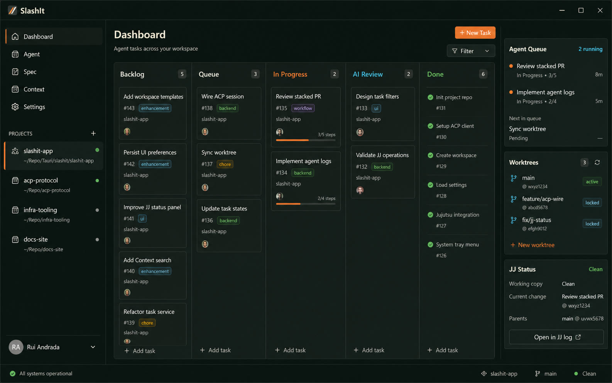
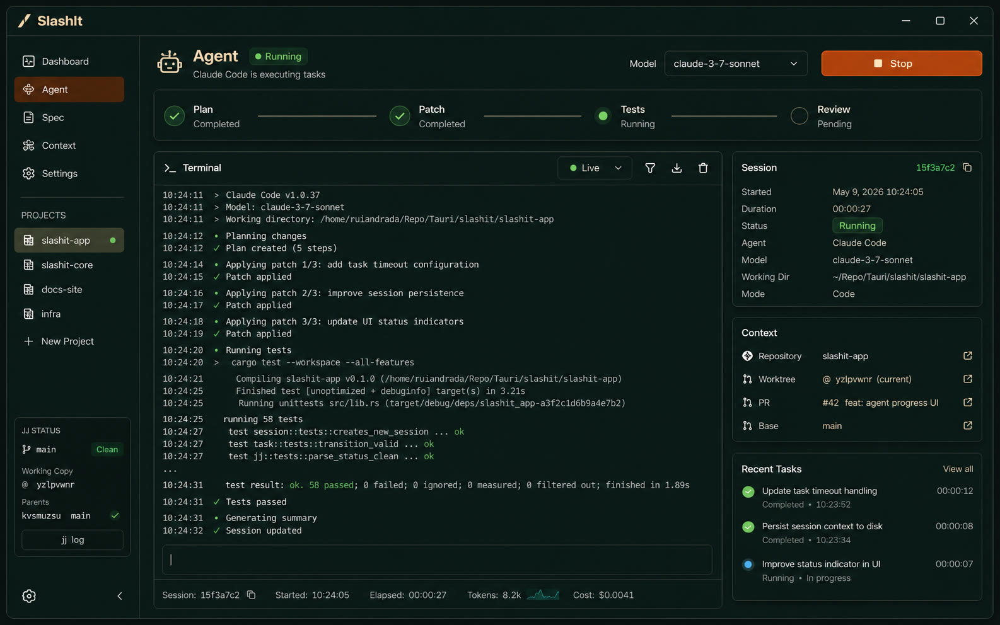
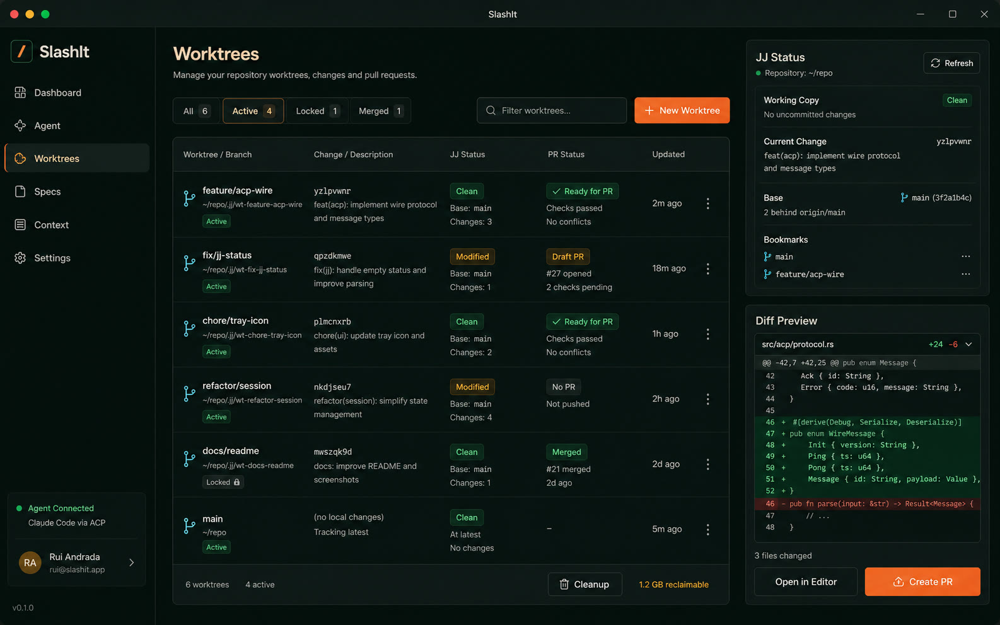

# SlashIt

<p align="center">
  
</p>

<p align="center">
  <strong>AI agent workspace management for people who run more than one thread of work at a time.</strong>
</p>

<p align="center">
  <a href="https://github.com/BarraDev/slashit/actions/workflows/ci.yml"></a>
  <a href="LICENSE"></a>
  <a href="https://github.com/BarraDev/slashit/releases"></a>
  <a href="https://github.com/BarraDev/slashit/stargazers"></a>
</p>

SlashIt is a Tauri v2 desktop app for managing AI coding agents, task queues, terminals, and version-control workspaces from one place. It is built entirely in Rust with a Leptos/WASM frontend and a native Tauri backend.

## Features

- **Kanban board** -- Organize work across Backlog, Queue, In Progress, Review, and Done.
- **AI agent execution** -- Run Claude Code agents against tasks with workspace isolation.
- **Queue system** -- Execute multiple tasks with configurable concurrency limits.
- **Integrated terminals** -- Keep PTY-backed terminals next to each task and workspace.
- **Jujutsu integration** -- Use `jj`-native workflows with Git interoperability.
- **GitHub/Jira import** -- Bring external issues into the local board.
- **PR management** -- Create and track pull requests from completed tasks.
- **PR review assistant** -- Triage reviewer comments on a PR, let the agent propose Fix / Skip / Question for each, then apply approved fixes and post replies back to the PR.
- **CLI tool** -- Control the running app from terminals and AI agents with `slashit`.
- **System tray** -- Keep agents and terminals alive after closing the window.
- **Auto-update** -- Check GitHub Releases for signed app updates.

## Screenshots

### PR review assistant

Triage every reviewer comment on a pull request, decide Fix / Skip / Question per item, edit the agent's reasoning and proposed change inline, then apply all approved fixes in one pass with optional auto-push and auto-reply on the PR.

<p align="center">
  
</p>

### Workspace overview (in progress)

The screens below preview the broader workspace, parts of which are still being polished.

<p align="center">
  
</p>

<p align="center">
  
</p>

<p align="center">
  
</p>

## Status and Roadmap

SlashIt is currently pre-1.0 software. The core app, CLI, IPC server, queue, terminals, updater wiring, and CI/release workflows are in place, but the public release is still being polished.

Near-term roadmap:

- Add installation walkthroughs and release notes polish.
- Track follow-up issues for GUI binary naming, optional daemon mode, and workspace layout cleanup.
- Continue hardening queue execution, agent recovery, and cross-platform packaging.

## Architecture

SlashIt is built entirely in Rust:

- **Frontend**: Leptos 0.8 (CSR, compiled to WASM)
- **Backend**: Tauri v2 with tokio async runtime
- **CLI**: Standalone binary communicating via Unix domain socket
- **IPC**: JSON-lines protocol over `$XDG_RUNTIME_DIR/slashit.sock`

```
slashit-app/
├── src/                    # Frontend (Leptos/WASM)
│   ├── components/         # UI components
│   ├── pages/              # Page views
│   ├── services/           # Tauri IPC service layer
│   └── models/             # Frontend models
├── src-tauri/              # Backend (Tauri v2)
│   └── src/
│       ├── commands/       # Tauri command handlers
│       ├── domain/         # Domain models
│       ├── agents/         # Agent execution engine
│       ├── queue/          # Task queue and executor
│       ├── pty/            # PTY terminal management
│       ├── ipc/            # Unix socket IPC server
│       └── config/         # Persistent storage
└── crates/
    ├── slashit-ipc/        # Shared IPC protocol types
    └── slashit-cli/        # CLI binary
```

## Installation

### Pre-built Binaries

Download the latest release for your platform from [GitHub Releases](https://github.com/BarraDev/slashit/releases).

| Platform | Format |
|----------|--------|
| Linux | `.AppImage`, `.deb` |
| macOS | `.dmg` |
| Windows | `.msi`, `.exe` |

### Build from Source

**Prerequisites:**

- Rust (stable toolchain)
- [Trunk](https://trunkrs.dev/) (`cargo install trunk`)
- `wasm32-unknown-unknown` target (`rustup target add wasm32-unknown-unknown`)
- System dependencies (Linux): `libwebkit2gtk-4.1-dev`, `libgtk-3-dev`, `libayatana-appindicator3-dev`

```bash
# Clone the repository
git clone https://github.com/BarraDev/slashit.git
cd slashit

# Development mode (recommended)
./dev.sh

# Or manually
NO_AT_BRIDGE=1 cargo tauri dev

# Production build
cargo tauri build

# Build CLI only
cargo build -p slashit --release
```

On non-GNOME Linux desktops such as i3 or sway, `NO_AT_BRIDGE=1` prevents a known WebKitGTK AT-SPI accessibility bridge crash.

## CLI Usage

The `slashit` CLI lets you control the running app from any terminal:

```bash
slashit status                              # App status overview
slashit projects                            # List projects
slashit tasks [--project ID]                # List tasks
slashit create --project ID "Task title"    # Create task
slashit move TASK_ID queue                  # Move task to status
slashit edit TASK_ID --title "New title"    # Edit task
slashit delete TASK_ID                      # Delete task
slashit queue                               # Queue status
slashit enqueue TASK_ID                     # Add task to queue
slashit terminals                           # List active terminals
slashit show                                # Bring window to front
```

Add `--json` to any command for machine-readable output. Use `--wait` to wait for the app to start.

## Configuration

Configuration is stored in your system config directory:

- Linux: `~/.config/slashit-app/`
- macOS: `~/Library/Application Support/com.barradev.slashit-app/`
- Windows: `%APPDATA%\com.barradev.slashit-app\`

## Development

Useful local checks:

```bash
cargo fmt --check
cargo clippy -p slashit-app -p slashit -p slashit-ipc -- -D warnings
cargo test -p slashit-app -p slashit-ipc
trunk build
```

This repository uses Jujutsu (`jj`) as the primary version-control workflow with a colocated Git repository for GitHub compatibility. Plain Git contributions are welcome.

To generate platform icons after updating `logo.svg`, run:

```bash
cargo tauri icon logo.svg
```

## Contributing

Contributions are welcome. Please read [CONTRIBUTING.md](CONTRIBUTING.md) before opening a pull request.

Security vulnerabilities should be reported privately; see [SECURITY.md](SECURITY.md).

## License

Copyright 2025 Barradev Digital Services

Licensed under the Apache License, Version 2.0. See [LICENSE](LICENSE) for details.
